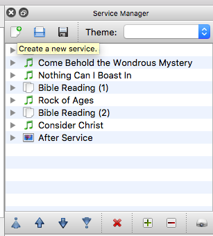
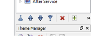

# Data Projector

## Turn on the Projector and Router

1. Turn on the router which is under the pot stand near the lectern
2. Turn power on to the projector
3. Turn on the projector

By now everything should be turned on, and this will appear on the screen.

## Connect the Laptop to the Projector

1. Start the WPS app from the dock. (Single 'click'.)

    

2. The WPS app should open and start searching. If the it doesn't automatically start searching, select `Search Server` from the menu.

    ​    

3. Once WPS has connected to the projector, it will request to change the screen resolution. Click `Ok` to change the resolution.

The laptop's resolution will now change (to no longer be widescreen). Shortly you should now see the laptop display *duplicated* on the projector screen, and the WPS application displayed as below.

## Getting Lyrics onto the Projector Screen

1. Start OpenLP

   

2. Double click on the first entry in the Service Manager. Normally this will be *Before Service*.
  

3. This should start a loop of notices slides.

4. To select the first song, double click on the song title. \(You only need to do this to get out of the loop.\)

5. The service can be controlled from the laptop. The ↓ and ↑ arrows move through slides (e.g. next/previous verse) and the ← and → arrows move *between* items (i.e. previous/next song).

## Controlling OpenLP from your Smart Phone

OpenLP can be controlled using your smart phone. All you need is a browser, but there is a dedicated app for both Android and iOS that is much easier to use.

1. Download the OpenLP app from the app store. [iOS](https://itunes.apple.com/us/app/openlp-remote/id1096218725?mt=8) [Android](https://play.google.com/store/apps/details?id=org.openlp.android2)
2. At church, connect your phone to the internal wifi network. The network name and password are written on peice of cardboard underneath the router. N.b. this network isn't connected to the internet, so you may not be able to access the internet on your phone/tablet whilst connected to this wifi network.
3. Start the OpenLP app. In the settings of the app, you need to enter the _Server IP_ address. Enter '192.168.1.11' as the _Server IP_ and '4316' as the _Port_.
4. You can now control OpenLP from your phone.

## Turning off the projector and laptop

1. Press the power button on the remote control twice.
2. Once the image is off the screen, and the fan stops within the projector, you can turn the power off at the switch in the entrance. \(Turning off the projector at the wall without following this procedure will cause the projector to overheat and shorten its lifespan.\)
3. Shutdown the Laptop by first quitting all applications, and then shutdown the computer (click `Apple→Shutdown`).

## How to Change Song Order (OpenLP)

If you need to change the order of songs

1. Select the song in the Service Manager
2. Click the blue ↓ or ↑ at the bottom of the Service Manager.

## How to Insert Songs (OpenLP)

1. Begin by typing the title of the song into the search box.
2. Select the song you wish to add.
3. Click the +button to add the song to Service Manager. \(If you double click on song title it will go to the Preview.\)
4. You can reorder the songs in the Service Manager by clicking the blue arrows.

