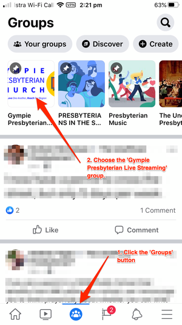
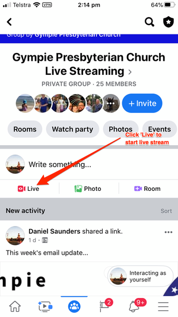

# Live Streaming

1. Open Facebook app on phone.
2. Click the _Groups_ icon \(in the current version, it's the middle icon in the bottom row\) \(see 1. below\).
3. Select the 'Gympie Presbyterian Church Live Stream' group \(see 2. below\).

4. Click the 'Live' button \(below the box where you can write a message or share a photo\).

Now the Live Streaming interface will open. You'll initially see a black screen with a large blue button \(and a few other buttons for filters/effects\), and then the camera view with the large blue button. 

1. Ensure the _back_ camera is being used \(i.e. you can't see yourself!\). 
2. Rotate the phone to landscape/wide orientation \(the blue button will now be on the right hand side of the screen\). 
3. Place the phone in the tripod. 
   1. Check the screen is showing \(1\) the speaker/lectern and \(2\) the data projector screen. 

4. Click the blue button to start the live stream. 
5. (Recommended\) Connect the phone to a power source \(battery/USB charger\).

## To end live stream

* Click the **Stop** button.
* Click the **Share** button - this will ensure the Live Stream stays on the Facebook group for later.