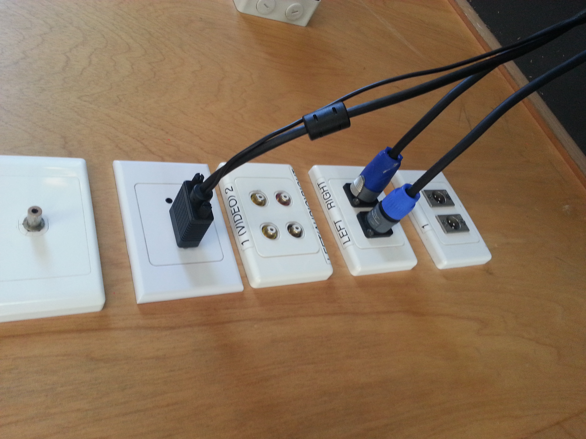
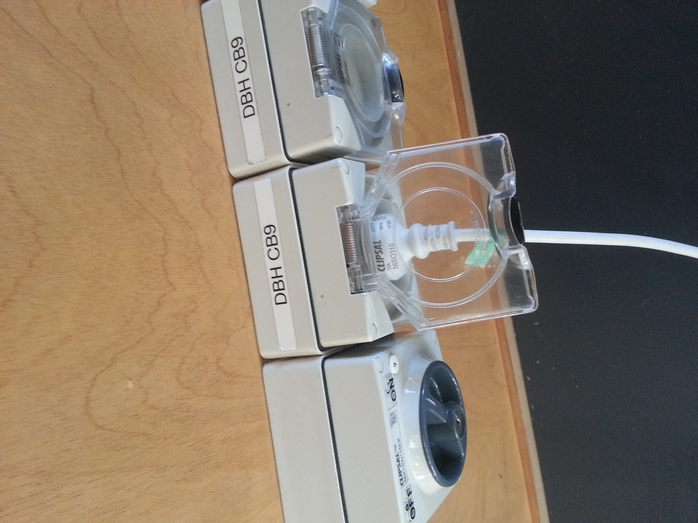
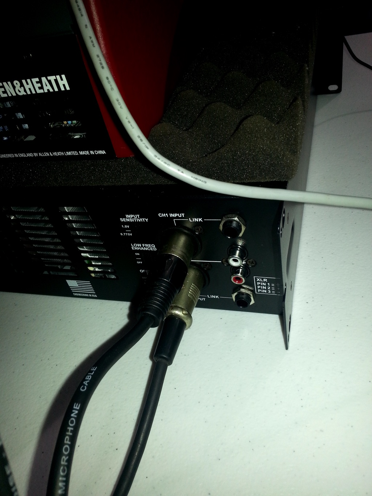
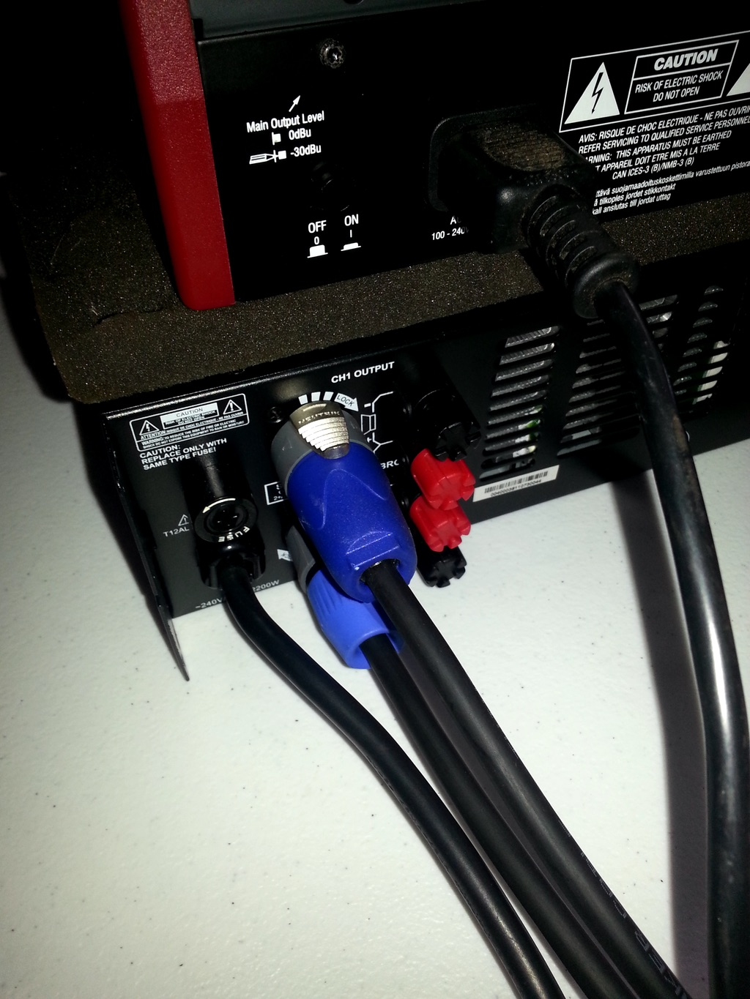
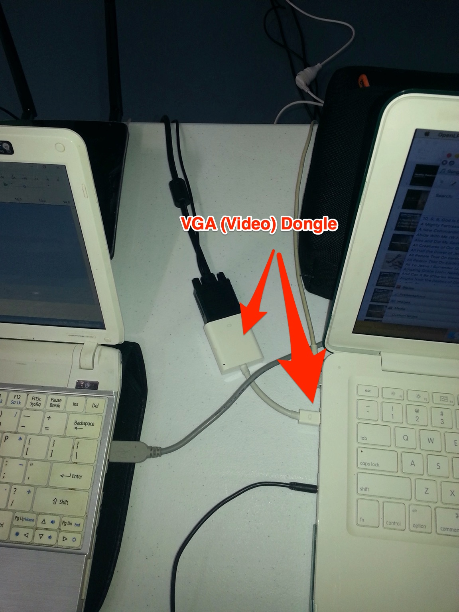
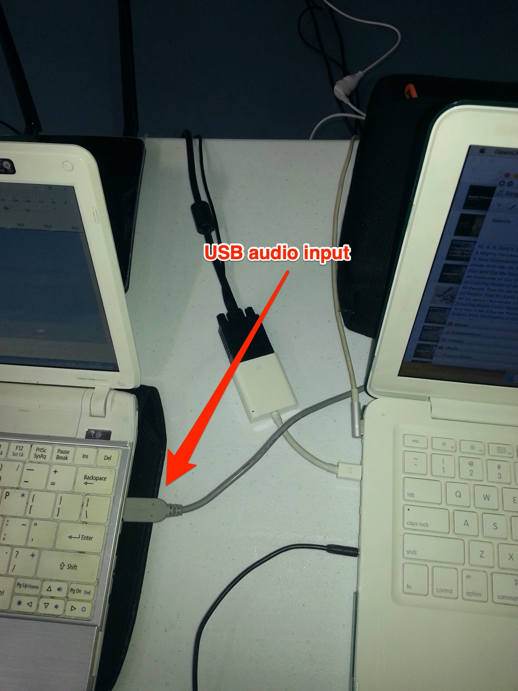
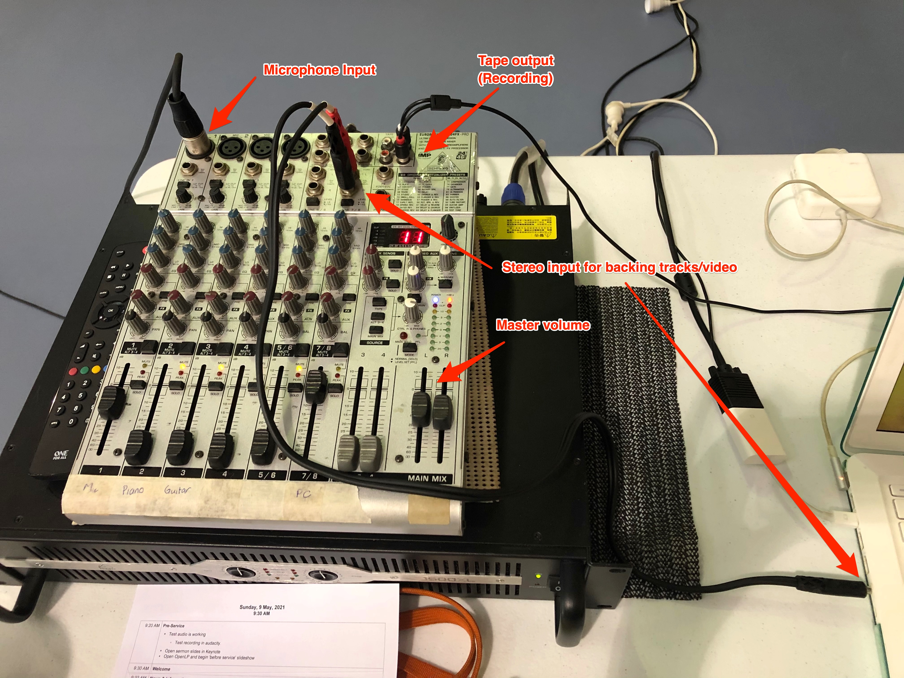
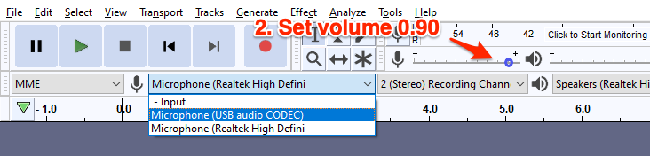

# Tech Setup

## Plug in the cables

### Plug into the wall

1. Connect the audio cables into the wall
   * These are _speakOn_ connectors. Connect by pushing into the socket and rotating clockwise until they lock.
2. Connect the video cable into the wall
   * This is a VGA connector. Plug in and screw to secure.
3. Plug power into the wall.
   * Connect the short extension lead into the wall.
   * Connect power-board.

 

### Setup the sound system and computers

1. Connect the mixing desk to the amplifier
   * There are two short 'microphone' cable leads, which connect between the rear right-hand side of the amplifier to the top-right hand side of the mixing desk \(see below for mixing desk\).

     
2. Connect the amplifier to the speakers

   * Once again these _speakOn_ cables connect to the rear of the amplifier by pushing in, then rotating clockwise to secure the connection.

   

3. Connect the Mac laptop to the VGA cable

   1. This requires the use of the dongle \(normally stored in the front pouch of the laptop bag\)
   2. The dongle plugs into the MacBook. Connect the VGA cable by pressing in a secure using the two screws.

   

4. Connect the laptops to the mixing desk
   1. The small white Windows laptop is used for recording sermon audio.

      * Connect the grey USB cable between the sound desk \(see below\) and the laptop.

      

   2. The MacBook is \(sometimes\) used for video or backing track
      * Connect the stereo audio output \(RCA\) cables from the mixing desk into the headphone socket on the MacBook 
5. Setup the mixing desk

   1. Plug microphone cables into channels 1-4.
   2. Connect the USB cable for recording sermon audio.
   3. \(If needed\) connect stereo cables from the MacBook into the red and white inputs to the right of the microphone inputs.
   4. Set volume levels using the faders at the bottom of each channel. Master volume is controlled by the **red** fader on the right side.

   

## Data Projector

### Lower the screen

* The control box for lowering/raising the projector screen is on the left-hand side of the projector screen, attached to the wall up high.
* Press the down button. The screen will automatically lower.

### Turn on the Projector

1. Point the remote control to the front of the projector.
2. Press the red power button until the small green LED on the projector starts blinking or you see some light emitting from the lens.

### Getting Lyrics onto the Projector Screen

1. Start OpenLP

   

2. Double click on the first entry in the Service Manager. Normally this will be _Before Service_. 
3. This should start a loop of notices slides.
4. To select the first song, double click on the song title. \(You only need to do this to get out of the loop.\)
5. The service can be controlled from the laptop. The ↓ and ↑ arrows move through slides \(e.g. next/previous verse\) and the ← and → arrows move _between_ items \(i.e. previous/next song\).

### Controlling OpenLP from your Smart Phone

OpenLP can be controlled using your smartphone. All you need is a browser, though there is a dedicated app for both Android and iOS that is much easier to use.

1. Download the OpenLP app from the app store. [iOS](https://itunes.apple.com/us/app/openlp-remote/id1096218725?mt=8) [Android](https://play.google.com/store/apps/details?id=org.openlp.android2)
2. Connect your phone to the _GympiePresbyterian_ wifi network. The network name and password are written on a piece of cardboard which is found in the orange and black laptop bag. N.b. this network isn't connected to the internet, so you may not be able to access the internet on your phone/tablet whilst connected to this wifi network.
3. Start the OpenLP app. In the settings of the app, you need to enter the _Server IP_ address. Enter '192.168.1.11' as the _Server IP_ and '4316' as the _Port_.
4. You can now control OpenLP from your phone.

### Turning off the projector and laptop

1. Press the power button on the remote control twice.
2. Shutdown the Laptop by first quitting all applications, and then shut down the computer \(click `→Shutdown`\).

### How to Change Song Order \(OpenLP\)

If you need to change the order of songs

1. Select the song in the Service Manager
2. Click the blue ↓ or ↑ at the bottom of the Service Manager.

### How to Insert Songs \(OpenLP\)

1. Begin by typing the title of the song into the search box.
2. Select the song you wish to add.
3. Click the +button to add the song to Service Manager. \(If you double click on song title it will go to the Preview.\)
4. You can reorder the songs in the Service Manager by clicking the blue arrows.

## Record Sermon Audio

1. Start Audacity \(Blue and Orange icon\)
2. Select _USB Audio Codec_ from the input/microphone drop down.
3. Set _input_ volume to 0.90

   

4. Test recording.
   1. Press the _Record_ button \(red circle\).
   2. The green _monitoring_ levels \(top of the screen\) will start moving and blue waveforms should appear for the Audio Track.
   3. You may need to adjust the volume so the peaks of the waveform hit around 0.5.
5. Save the file. The file format should be in the format YYYYMMDD\_SermonTitle\_PreacherInitials.
6. Delete the test recording \(click the small `x` button on the Audio Track\).
7. The computer is now ready to record.

